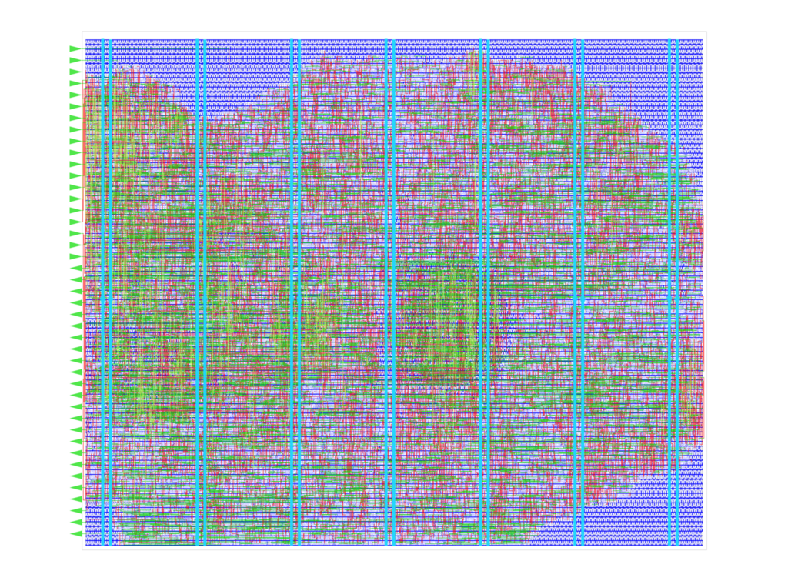

# FazyRV ExoTiny CCX @ HeiChips 2025

FazyRV ExoTiny CCX implements an minimal-area SoC with custom instruction interface based on the FazyRV RISC-V core.



## Overview
The implementation and documentation are split across multiple repositories:
* **This repo** is the **user design** without eFPGA. It is embedded in the [HeiChips 2025 Tapeout](https://github.com/FPGA-Research/heichips25-tapeout) on IHP SG13G2 130nm process.
* **SoC**: The user design in this repo is a wrapper around the [FazyRV ExoTiny SoC](https://github.com/meiniKi/FazyRV-ExoTiny/tree/heichips25_ccx).
* **RISC-V core**: The SoC instantiates a version of the [FazyRV](https://github.com/meiniKi/FazyRV/tree/heichips25_ccx) core that has been extended by a Chunked Custom eXtension (CCX) interface for custom instructions.

> [!NOTE]  
> Make sure to init the submodule by `git submodule update --init --recursive .`

## Top-Level Simulation

Testing is covered chiefly at the SoC and core levels. This repository adds tests to ensure the top-level wrapper is wired correctly.

```
cd sim
make test_vcd
```

## Implementation

```
nix-shell
make macro
```

## Checklist

- [x] The project top-level has a unique name starting with `heichips25_`.
- [ ] The design is verified and tested.
- [ ] The macro is stored under `macro/`.
- [ ] `TopMetal2` in the macro is empty (for integration).
- [ ] The macro is DRC clean (minimal DRC set without fill checks).
- [ ] The macro uses the default power pins (VPWR, VGND).
- [ ] The project is licensed under Apache 2.0.

## License

The code in this repository is licensed under Apache 2.0.